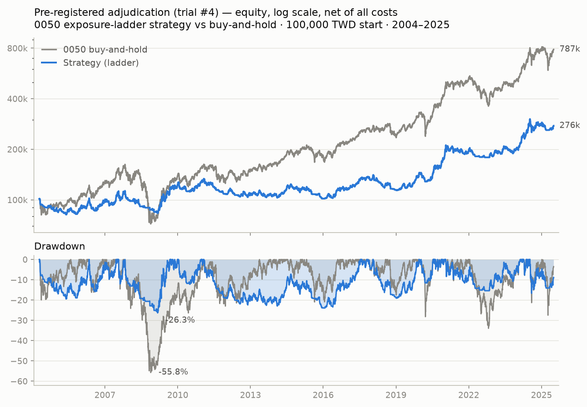
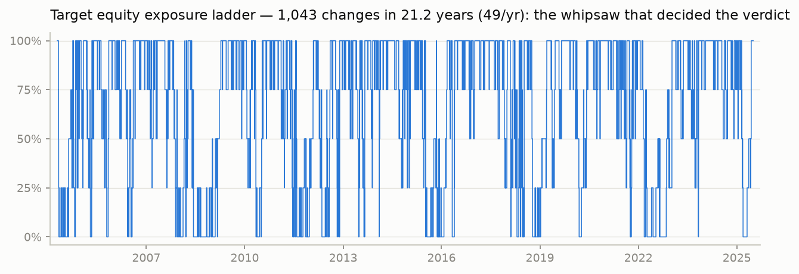
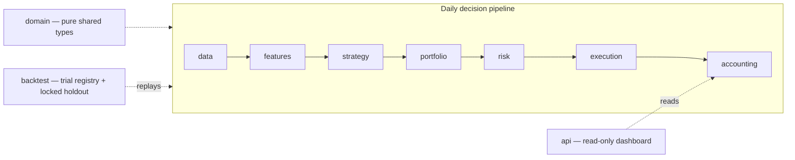

# TW Stock Signal — a pre-registered timing experiment on Taiwan's 0050

[](https://github.com/0Smallcat0/tw-stock-trading/actions/workflows/ci.yml)


[](LICENSE)

A research program that asked one question with real money consequences:
**can a retail, long-only, public-data strategy beat buying and holding 0050
(Taiwan Top 50 ETF)?** It answered the question three pre-registered ways —
trend-timing, leveraged ETFs, and a low-volatility factor — on 21+ years of
total-return data, and had the discipline to report what the evidence said:
**three FAILs. The honest answer is buy-and-hold.**

The deliverables are the full backtesting system (data pipeline → strategy →
risk → paper execution → accounting), the anti-overfitting validation gate
that produced the verdicts, and the verdicts themselves.

<picture>
  <source media="(prefers-color-scheme: dark)" srcset="docs/assets/trial4_equity_drawdown_dark.png">
  
</picture>

## Headline result (primary experiment, trial #4)

21.21 years of real 0050 total-return data (2004-04 → 2025-07), net of all
Taiwan trading costs (commission with minimum fee, sell-side transaction tax,
slippage), next-trading-day execution:

| | Strategy (exposure ladder) | 0050 buy-and-hold |
| --- | --- | --- |
| Final equity (100,000 TWD start) | 276,230 (+176%) | **787,034 (+687%)** |
| CAGR | 4.91%/yr | **10.21%/yr** |
| Max drawdown | **26.32%** | 55.75% (2008) |
| Ladder changes per year | 49.2 | 0 |
| Total costs paid | 71,771 TWD | — |

Pre-registered claim: drawdown ≤ 60% of benchmark's **and** CAGR within 3pp of
benchmark. Drawdown protection passed; the CAGR cost of 5.3pp/yr failed the
gate — 49 ladder changes a year is a whipsaw machine, and under Taiwan's
statutory cost structure the rule has no room to live. Per the pre-registered
stop rule, the production runtime was never built.
Full adjudication: [`docs/reports/TW_QUALIFICATION_VERDICT.md`](docs/reports/TW_QUALIFICATION_VERDICT.md).

<picture>
  <source media="(prefers-color-scheme: dark)" srcset="docs/assets/trial4_exposure_dark.png">
  
</picture>

## Three pre-registered experiments, three honest verdicts

| Route | Pre-registered claim | Verdict | Decisive evidence |
| --- | --- | --- | --- |
| **TW** — trend-ensemble exposure ladder on 0050 | MaxDD ≤ 60% × B&H **and** CAGR ≥ B&H − 3pp | **FAIL** | Drawdown 26.3% vs 55.8% ✓, but CAGR −5.3pp ✗ (whipsaw) |
| **TW2** — leveraged ETF (00631L) 50/50 + cash, quarterly rebalance | CAGR ≥ B&H **and** MaxDD ≤ B&H | **FAIL** | −1.69pp/yr CAGR **and** deeper drawdown (56.0% vs 55.8%, incl. synthetic 2008) |
| **TW4** — low-volatility factor over a 2,150-stock survivorship-mitigated universe | CAGR ≥ B&H, MaxDD ≤ B&H, PBO ≤ 0.05, DSR ≥ 0.95 | **FAIL** | CAGR 8.08% vs 10.82%; CSCV/PBO = 0.115 flagged the only Sharpe-winning configs as parameter-unstable |

The failures are complementary, which is the finding: routes that beat the
benchmark's return blow through its drawdown (TW2), and routes that contain
drawdown give up too much return (TW, TW4). The no-free-lunch held in both
directions — established on self-built, cross-validated data with fishing
forbidden by pre-registration.

Reports: [`TW2_LEVERAGE_VERDICT.md`](docs/reports/TW2_LEVERAGE_VERDICT.md) ·
[`TW4_LOWVOL_VERDICT.md`](docs/reports/TW4_LOWVOL_VERDICT.md) ·
independent adversarial audit [`TW_VERDICT_AUDIT_2026-07-04.md`](docs/reports/TW_VERDICT_AUDIT_2026-07-04.md)
(research reports are written in Traditional Chinese).

## Research methodology — why a FAIL is a result, not an accident

The validation gate ([`docs/contracts/VALIDATION_GATE_CONTRACT.md`](docs/contracts/VALIDATION_GATE_CONTRACT.md))
was designed before results existed, so a good-looking backtest could not
negotiate its way past it:

- **Pre-registration.** Primary claims and tolerances written down before any
  backtest ran; failed claims stop the project by rule, not by judgment.
- **Append-only trial registry.** Every backtest run counts toward N and is
  recorded with config hash and code version
  ([`trial_registry.jsonl`](docs/reports/research/trial_registry.jsonl), N=6 on
  the primary route — including the two runs invalidated by bugs, kept visible).
- **Single-use locked holdout.** Data after 2025-07-03 is sealed
  ([`holdout_lock.json`](docs/reports/research/holdout_lock.json)) and was
  never spent — it remains a clean final exam for any future variant.
- **Overfitting statistics.** CSCV/PBO (probability of backtest overfitting)
  and Deflated Sharpe Ratio gate the factor experiment; PBO correctly caught
  the only "winning" parameter cells as unstable.
- **Adversarial audit.** The primary verdict was independently re-derived
  (full replay, cost counterfactual scan, benchmark anchored externally at
  0.0pp deviation) and the audit's disclosures are published alongside it.
- **Lookahead discipline.** Dual price series (signals read dividend/split-
  adjusted data; accounting reads raw), 200-close warmup, decisions execute
  next trading day — enforced by golden tests, not convention.
- **Survivorship honesty.** The factor universe's survivorship mitigation is
  disclosed with direction-of-bias reasoning: the bias only flatters returns,
  so the return FAIL is *a fortiori* robust.

## Engineering



- **Boundaries are compiler-enforced, not aspirational.** 15 import-linter
  contracts keep layers honest (strategy cannot size or trade, risk sees only
  supplied facts, execution is paper-only, API is read-only) — checked in CI
  together with `mypy --strict` (62 modules) and ruff.
- **371 offline tests** run in ~5 s; network-dependent tests are marked and
  excluded from CI.
- **Taiwan market realism.** Corporate-action adjustment factors built from
  official rows; ROC-era date parsing (three boundary formats); an exchange
  calendar that models typhoon closures, make-up workdays, and multi-session
  halts; tick-bracket price rounding; commission floor and instrument-specific
  sell-side tax.
- **Safe by construction.** Keyless public data only (TWSE / FinMind
  anonymous). No broker API, no credentials, no real orders — permanently, by
  product definition. A 100,000 TWD virtual account is the honest scoreboard.
- Architecture is shared with the crypto sibling project this was forked from;
  the market semantics (calendar, costs, corporate actions, dual series) are
  Taiwan's. System map: [`tw_quant_architecture.md`](tw_quant_architecture.md).

## Repository map

| Path | What lives there |
| --- | --- |
| `src/` | Layered system: `domain`, `data`, `features`, `strategy`, `portfolio`, `risk`, `execution`, `accounting`, `backtest`, `factor`, `leverage`, `api`, … |
| `docs/contracts/` | Behavioral contracts (validation gate, risk gate, strategy, universe, data adapter) |
| `docs/research/` | Pre-registrations and design research, including the [multi-engine allocation research](docs/research/MULTI_ENGINE_FRAMEWORK_RESEARCH.md) |
| `docs/reports/` | Verdicts, adversarial audit, trial registry, per-trial return series |
| `scripts/` | Backfill, ingestion, registered backtest CLIs, chart generation |
| `tests/` | 371 offline tests mirroring the `src/` layout |

## Reproduce

Python 3.12, Windows or POSIX:

```powershell
py -3.12 -m venv .venv
.\.venv\Scripts\python.exe -m pip install --upgrade pip
.\.venv\Scripts\python.exe -m pip install -e ".[dev]" -c requirements\constraints-dev.txt
```

Verification (same commands CI runs):

```powershell
.\.venv\Scripts\python.exe -m ruff check .
.\.venv\Scripts\python.exe -m ruff format --check .
.\.venv\Scripts\python.exe -m mypy --strict src/
.\.venv\Scripts\lint-imports
.\.venv\Scripts\python.exe -m pytest -m "not network" tests -q
```

The README charts rebuild from committed artifacts (per-trial daily returns +
benchmark series) and refuse to render unless they reproduce the adjudicated
headline numbers:

```powershell
.\.venv\Scripts\python.exe -m pip install matplotlib
.\.venv\Scripts\python.exe scripts\make_readme_charts.py
```

Re-running backtests end-to-end needs the local TimescaleDB
(`docker compose up -d`, port 54321, dummy dev credentials in
`docker-compose.yml`) and the backfill scripts in `scripts/`.

## What's next

The single-engine question is closed. The researched follow-up is a
**multi-engine cross-market allocator** (low-correlation return engines under
shrinkage risk parity + fractional Kelly):
[`docs/research/MULTI_ENGINE_FRAMEWORK_RESEARCH.md`](docs/research/MULTI_ENGINE_FRAMEWORK_RESEARCH.md).
Empirical groundwork is done (TW↔crypto monthly correlation 0.13–0.20 on local
data); implementation would enter as a new pre-registered experiment against
the still-sealed holdout.

## License

MIT — see [`LICENSE`](LICENSE).
